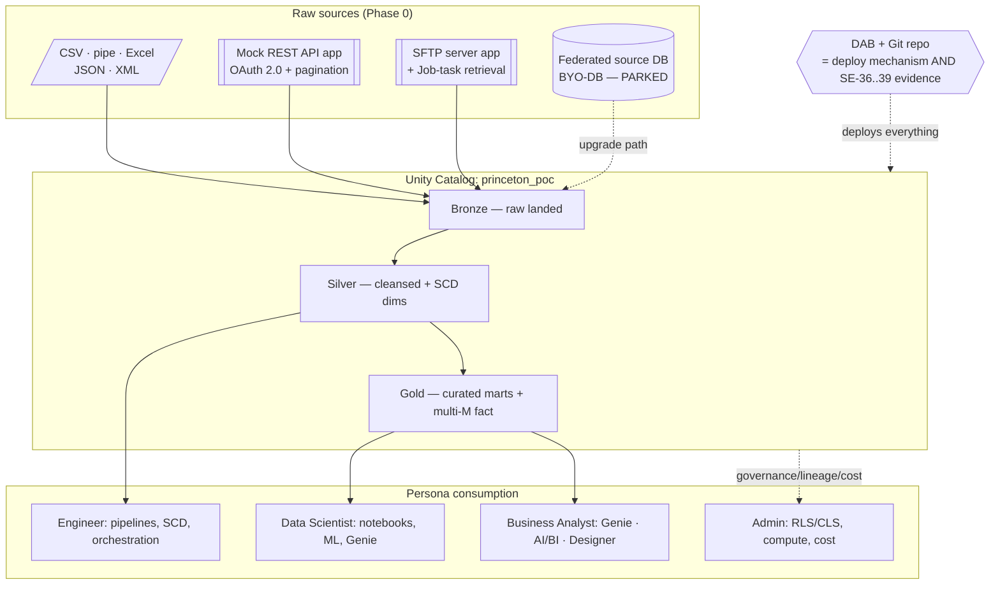

# Princeton University — Data Platform Modernization POC — Build Design

**Date:** 2026-07-30
**Status:** Approved design → proceeding to implementation plan
**Author:** DMIA POC build team (Databricks Field Engineering)

---

## 1. Purpose

Princeton's Data Management, Integration, and Analytics (DMIA) team issued an RFP
with a catalogue of ~60 POC test scenarios across four personas. This document is
the **design** ("what and why") for the Databricks POC build that demonstrates every
scenario. A companion **implementation plan** ("how, in order") will follow and is the
document we execute against 1-by-1.

**Governing principle: simpler is better.** The POC proves *capability*, not a
production platform. Fewest artifacts that let each scenario be demonstrated honestly.

### Guiding requirements (from the customer)

1. **Shared, reusable dataset** — all ~60 scenarios run against ONE common data
   foundation so every demo works on the same set of data.
2. **Genie/Assistant code prompts as the primary build path** — most of the build is
   demonstrated via natural-language prompts. We supply the prompt; the DMIA team
   generates the object live.
3. **Pre-built objects as fallback** — every scenario has a pre-built object so a demo
   never dead-ends if a prompt drifts.
4. **Lakeflow Designer** as the no-code/low-code authoring surface where a scenario
   suits a pipeline — satisfying the RFP's repeated "both code and no-code" ask.
5. **Design in combinations, build 1-by-1** — one built object may cover several
   scenario IDs (with a read-out write-up), but each object is built, run, and
   verified green before the next.
6. **Build internally, deploy to the customer POC workspace** via a DAB + Git repo.

---

## 2. Personas (from the RFP)

- **Persona 1 — Software / Data Engineer** (SE-01…SE-43): Oracle SQL/PLSQL, ETL,
  Python, bash, REST, SFTP. Builds and operates pipelines.
- **Persona 2 — Data Scientist / Advanced Analyst** (DS-01…DS-09): SQL, Python, R,
  ML. Needs notebooks, direct data access, BYO-data blending.
- **Persona 3 — Business Analyst** (BA-01…BA-08): limited/no SQL. Excel, reporting.
  Needs no-code self-service.
- **Persona 4 — Platform Administrator** (PA-01…PA-25): Linux/SFTP, security access,
  Oracle FGAC (row/column security). Governs identity, security, compute, cost.

---

## 3. Architecture & build map

One shared higher-ed dataset flows through a medallion architecture in a single Unity
Catalog catalog (`princeton_poc`). Every scenario reads from / writes to that
foundation. Scenarios are demonstrated via a three-artifact "kit" (Designer prompt /
Assistant code prompt / pre-built fallback), and multiple scenarios collapse onto
shared objects.

### Packaging & deployment

- **Databricks Asset Bundle (DAB) in a Git repo** packages everything (data-gen,
  pipelines, jobs, UC setup, dashboards, apps) and deploys to any workspace with one
  command. The **UC namespace itself** — catalog, schemas, volume — is declared as
  native DAB resources (created at `bundle deploy`, before any job runs), with the
  catalog's `storage_root` supplied per target as a bundle variable. No imperative
  `CREATE CATALOG` scripting.
- The bundle **is** the live evidence for SE-36 (source control), SE-37 (env
  promotion via dev/qa/prod targets), SE-38 (CI/CD), SE-39 (rollback).
- Deterministic data generation (fixed seed) → identical data in our internal
  workspace and the customer POC workspace. Reproducible demos.

---

## 4. The shared data foundation (Phase 0)

**Domain:** Princeton higher-ed operational. Five things to build:

### 4.1 Core entity model (one deterministic generator)

Normalized higher-ed schema, generated with a fixed seed and a `row_count` parameter.

| Entity | Grain | Approx volume | Notes |
|---|---|---|---|
| `department` | one dept | ~40 | **Universal RLS key** (`dept_id`) — on student, faculty, course |
| `term` | one academic term | ~24 (8yr × 3) | Time backbone for SCD dates |
| `faculty` | one faculty member | ~2,000 | PII: `ssn` |
| `course` | one course offering | ~5,000 | FK dept, faculty |
| `student` | one student | ~30,000 | PII: `ssn`, `dob`; `status` = SCD-Type-2 tracked attribute |
| `enrollment` | student×course×term | see 4.4 | The fact |
| `financial_aid` | one award | ~50,000 | `amount` = CLS target |

Design intent: PII concentrated deliberately (masking PA-07 / restriction PA-08
targets); `dept_id` everywhere (RLS PA-09/10); `student.status` as the SCD-Type-2
attribute.

### 4.2 Raw source files (format variety — small, human-inspectable)

Same data rendered in different formats on a UC Volume
(`/Volumes/princeton_poc/landing/...`), with deliberate "gotchas" the RFP names.

| File | Format | Scenario | Deliberate gotcha |
|---|---|---|---|
| `students.csv` | CSV, header | SE-04 | Quoted fields with embedded commas |
| `enrollments.pipe.txt` | pipe-delimited | SE-04 | Field containing a pipe; mixed line endings |
| `financial_aid.xlsx` | multi-sheet Excel | SE-05 | Target a *named* sheet, not sheet 1 |
| `course_catalog.json` | nested JSON | SE-06 | Nested objects/arrays; optional keys absent |
| `faculty.xml` | XML repeating elements | SE-07 | Optional nodes → null, not row-drop |

Scale story lives in the fact table (4.4), not here.

### 4.3 Mock REST API app

- In-workspace **Databricks App (FastAPI)** serving higher-ed data over the same core.
- **OAuth 2.0 client-credentials** auth (token endpoint + bearer).
- Page-number + `next` cursor pagination, ~100 rows/page.
- **Short token TTL (~5 min)** so token refresh is *observable* mid-ingestion (SE-08).

### 4.4 Multi-million-row fact (`enrollment_history`) — scale & compute

- Grain: one student in one course in one term; deep historical volume.
- **Tunable `row_count`**: ~5M internal (build/test) → ~50M in POC. Same generator.
- Gold layer, liquid clustering on term + dept.
- Companion **heavy analytical query** (big join + window + aggregate) = the reusable
  "load" for the compute scenarios.
- Powers DS-05 (large dataset) and PA-13…PA-18 (compute/capacity). Deterministic seed
  → repeatable run-time/cost comparisons (PA-19…PA-25).

### 4.5 SFTP server app + native retrieval

- In-workspace **Databricks App** serving dated `financial_aid_YYYYMMDD.csv` over real
  SFTP.
- **Retrieval = a Lakeflow Job task** (Python + `paramiko`), pattern-matched
  (`financial_aid_*.csv`), credentials in a UC secret, scheduled + git-versioned →
  lands on a UC Volume; Auto Loader ingests. **Native, orchestrated, no standalone
  shell script** (the SE-09 win condition is "no custom shell script").
- **Upgrade path (parked):** Lakeflow Connect SFTP connector (Public Preview) if the
  customer obtains the preview — collapses retrieval+ingest into one managed connector.

### 4.6 Day-2 change script (drives CDC / SCD / drift)

Not a second dataset — **one small script**: a dozen lines of DML
(`INSERT`/`UPDATE`/`DELETE`) + one `ALTER TABLE`. Applied on top of the baseline; the
change-capture mechanism picks it up. The SQL is self-documenting (doubles as the
known-answer oracle). CDC / Delta Change Data Feed does the diffing downstream — no
manual two-version diff.

- Powers SE-03, SE-21, SE-22, SE-23 (via `apply_changes` / CDF) and SE-41 (the
  `ALTER TABLE`).
- **SE-42 (data/anomaly drift) is separate** — that's Lakehouse Monitoring
  (profile/drift metrics), not change capture.

---

## 5. Scenario-combination map

Design in combinations; build 1-by-1. Each row = one built object = one read-out
write-up. **~60 scenarios → ~30 objects.**

### Persona 1 — Software / Data Engineer (43 → 11 objects)

| # | Built object | Scenarios | Path(s) |
|---|---|---|---|
| E1 | Multi-format file ingestion (Auto Loader) | SE-04,05,06,07,09 | Designer + Assistant |
| E2 | DB ingestion (full extract + custom SQL w/ proc) | SE-01,02 | Assistant + pre-built *(BYO-DB parked)* |
| E3 | REST API ingestion | SE-08 | Assistant + pre-built |
| E4 | Multi-source merge (file+DB+API on one canvas) | SE-10 | Designer + Assistant |
| E5 | "Kitchen-sink" transformation pipeline | SE-11…SE-20 | Designer + Assistant |
| E6 | CDC + SCD (day-2 script → apply_changes) | SE-03,21,22,23 | Assistant + pre-built |
| E7 | Target loading (UPSERT/delete + file outputs) | SE-24,25,26,27 | Designer + Assistant |
| E8 | Orchestration job (chain, parallel, retry, alert, external call, schedule, bulk pause) | SE-28,29,30,31,32,33,35 | Jobs UI + Assistant |
| E9 | Monitoring/ops walkthrough | SE-34 | Pre-built (Jobs UI) |
| E10 | The DAB + Git repo itself | SE-36,37,38,39 | The bundle is the artifact |
| E11 | Governance walkthrough (lineage, schema drift, Monitoring, catalog) | SE-40,41,42,43 | Pre-built (UC/Catalog Explorer) |

### Persona 2 — Data Scientist (9 → 8 objects)

| # | Built object | Scenarios | Path(s) |
|---|---|---|---|
| DS-A | SQL + Genie exploration over Gold | DS-01 | Genie + Assistant/SQL |
| DS-B | Python + R notebooks (read/transform/write + BYO upload) | DS-02,03,04 | Notebook |
| DS-C | Large-dataset query on multi-M fact | DS-05 | Notebook/SQL + query profile |
| DS-D | Local/laptop connectivity (Python/R/SAS/SPSS, inherits UC perms) | DS-06(a) | Pre-built (connection guide) |
| DS-E | In-platform ML training (MLflow) | DS-06(b) | Notebook + Assistant |
| DS-F | Scheduled notebook/script → target table | DS-07 | Jobs + Assistant |
| DS-G | Notebook version control + sharing | DS-08 | Git folders (rides on E10) |
| DS-H | In-platform visualization | DS-09 | Notebook viz / AI-BI |

**Note:** RFP has a duplicate **DS-06** ("local connectivity" AND "in-platform ML").
Split as DS-06(a)/(b); flag numbering error to Princeton in the read-out.

### Persona 3 — Business Analyst (8 → 5 objects, all no-code/low-code)

| # | Built object | Scenarios | Path(s) |
|---|---|---|---|
| BA-A | No-code browse + filter + preview | BA-01 | Genie / Catalog Explorer |
| BA-B | Scheduled report/dataset subscription + delivery | BA-02 | AI-BI subscription |
| BA-C | Ad-hoc extract to CSV/Excel/pipe | BA-03,06,07 | No-code export |
| BA-D | Upload + join spreadsheet, light transform (rename/filter/derive) | BA-04,05 | Lakeflow Designer |
| BA-E | Save + reuse a self-service workflow | BA-08 | Designer saved pipeline |

### Persona 4 — Platform Administrator (25 → 6 objects)

| # | Built object | Scenarios | Path(s) |
|---|---|---|---|
| PA-A | Identity & access (users, groups, env segregation, object perms, audit, service principals/rotation) | PA-01…06 | UC + account console |
| PA-B | Column masking + column restriction | PA-07,08 | UC column masks + Assistant |
| PA-C | Row-level security (attribute + dynamic by identity) | PA-09,10 | UC row filters + Assistant |
| PA-D | Policy test + inventory ("faux user" impersonation, policy catalog) | PA-11,12 | Pre-built (UC + system tables) |
| PA-E | Compute mgmt (manual/auto scale, isolation, pause/resume, capacity dashboard, prioritization) | PA-13…18 | Warehouses/serverless config |
| PA-F | Cost & chargeback (spend dashboard, by user/dept/pipeline, budget alerts, forecast, query cost est, optimization recs) | PA-19…25 | AI-BI on system.billing + tags |

---

## 6. Build sequencing

Foundation first, then persona-by-persona. Each phase independently demoable. Design
in combinations, build/test 1-by-1.

- **Phase 0 — Foundation:** the 5 foundation pieces (4.1–4.6), UC catalog/schemas,
  DAB skeleton, dev/qa/prod targets.
- **Phase 1 — Engineer (E1…E11).**
- **Phase 2 — Data Scientist (DS-A…DS-H).**
- **Phase 3 — Business Analyst (BA-A…BA-E).**
- **Phase 4 — Admin (PA-A…PA-F).**

Per object: build → run → verify green → write the combination read-out → next.

---

## 7. Per-scenario read-out format (maps to RFP §7 Vendor Response Format)

Each combined object produces a write-up with: Scenario ID(s), Coverage
(Full/Partial/Workaround/Not Supported), Platform Component, Demo Planned (Designer
prompt / Assistant prompt / pre-built), Prerequisites, Notes/Constraints. Combination
objects state explicitly which scenario IDs they satisfy and where each appears.

---

## 8. Open decisions (parked — resolve at build time)

1. **BYO source database (element 3 / SE-01, SE-02, SE-03).** Customer will bring/
   decide the source DB. Affects native-CDC options:
   - **A. Lakeflow Connect DB CDC (gateway)** — native log-based, delete detection;
     SQL Server = GA, Postgres = Public Preview; needs gateway (classic compute) +
     network path.
   - **B. Snapshot CDC in a Declarative Pipeline** (`apply_changes_from_snapshot`) —
     guaranteed baseline; reuses foundation; no gateway. **Always built** so SE-03
     never dead-ends.
   - **C. Federation + manual watermark** — weakest (misses hard deletes); contrast
     only.
   Design is source-engine-agnostic: everything downstream reads from Bronze, so
   swapping the source DB later doesn't ripple.
2. **SFTP Lakeflow Connect preview (element 5 / SE-09).** Customer may obtain the
   preview; if so, it becomes the headline managed path. Baseline (App + Job-task
   retrieval) works regardless.
3. **Scale target volume (4.4).** ~5M internal / ~50M POC assumed; confirm against
   Princeton's real scale expectations.
4. **Compute surface for PA-13…18** — SQL Warehouses vs serverless vs both; confirm
   which knobs to turn.

---

## 9. Known RFP anomalies to flag in the read-out

- **Duplicate DS-06** — used for both "local connectivity" and "in-platform ML".
  Handled as DS-06(a)/(b).
